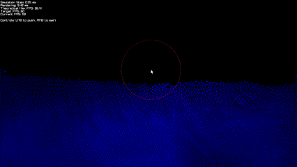

# SPH-CUDA: A Smoothed Particle Hydrodynamics Simulation

This project implements a simplified Smoothed Particle Hydrodynamics (SPH) simulation using CUDA for parallel computation and raylib for real-time visualization. It uses a uniform grid to speed up neighbor searches, allowing the simulation to scale to thousands of particles.

## Result



The simulation showcases fluid approximating properties like water.
This simulation contains **15 000 particles** and runs at consistent **60 FPS (with theoratical maximum of 90 FPS)** on a **RTX 3080**.
It also showcases mouse interaction, where the user can push or swirl the fluid by clicking and dragging the mouse.
The different colors represent the velocity of the particles, with white being the fastest and blue being the slowest.

---

## Project Structure

This repository is separated into **two parts**:

1. The implementation of the SPH simulation using **CUDA and C++** for high performance.
2. A **jupyter notebook** that is designed to explain the SPH algorithm and its implementation in detail.

### Directory Structure

SPH-CUDA  
├── docs  
├── include  
│ ├── config.h  
│ ├── grid.h  
│ ├── kernels.h  
│ ├── particle.h  
│ └── renderer.h  
├── python  
│ ├── particle-based_fluid.ipynb  
│ └── req.txt  
├── src  
│ ├── kernels.cu  
│ ├── main.cu  
│ └── renderer.cu  
├── .gitattributes  
├── .gitignore  
├── CMakeLists.txt  
└── README.md

- **docs**: Contains images and other documentation files.
- **include**: Holds header files for various parts of the simulation.
- **python**: Contains a jupyter notebook that explains the SPH algorithm and its implementation in detail.
- **src**: Contains the CUDA and C++ source files.
- **.gitignore**: Specifies which files and folders Git should ignore.
- **.gitattributes**: Configures Git attributes for the repository.
- **CMakeLists.txt**: Build configuration for CMake.
- **README.md**: This documentation.

---

## Setup

This section explains how to set up the CUDA simulation as well as the jupyter notebook.

### Setup for CUDA implementation

The project containes a CMakeLists.txt file for easy building. The project is designed to be built with CMake, which will handle the.
The setup is designed for Windows, but it should work on Linux and MacOS with minor modifications.

#### Prerequisites

- A CUDA-capable GPU with the NVIDIA driver installed
- NVIDIA CUDA Toolkit (tested with 12.8)
- CMake (3.30 or higher)
- Build tools (e.g., Visual Studio, GCC, etc.)

#### Steps

1. Clone the repository and navigate into it.
2. Create a build directory and run CMake:

   ```bash
   mkdir build && cd build
   cmake ..
   ```

3. Build the project:

   ```bash
   cmake --build .
   ```

4. Run the generated executable:

   ```bash
   .\Debug\SPH_CUDA.exe
   ```

---

### Setup for Jupyter Notebook

1. Go into the `python` directory.

   ```bash
   cd python
   ```

2. Create a virtual environment (optional but recommended):

   ```bash
   python -m venv venv
   ```

3. Activate the virtual environment:

   - On Windows:

     ```bash
     venv\Scripts\activate
     ```

   - On Linux/MacOS:

     ```bash
     source venv/bin/activate
     ```

4. Install the required packages:

   ```bash
   pip install -r req.txt
   ```

5. Launch Jupyter Notebook:

   ```bash
   jupyter notebook
   ```

6. Open the `particle-based_fluid.ipynb` notebook to explore the SPH algorithm and its implementation.

---

## Components of CUDA implementation

This section describes the main components of the CUDA simulation and how they interact.

### config.h

Defines all the simulation parameters, such as the domain size, number of particles, and time step. Keeping these
constants in a single file makes them easy to manage.

### grid.h

Contains inline helper functions for converting particle positions to grid coordinates, retrieving neighboring cell indices, and more. These functions are used by the CUDA kernels to organize particles in a grid for faster neighbor
searches.

### kernels.h

Declares all CUDA kernels for:

- Updating grid structures
- Computing particle density, pressure, and forces
- Integrating particle positions
- Handling mouse interactions and boundaries

### particle.h

Defines the `Particle` struct. Each particle stores:

- Position
- Old position (for stable integration)
- Velocity
- Force
- Mass
- Density
- Pressure

Also contains inline vector math utilities (`lengthF2`, `subtractF2`) used by both host code and CUDA kernels.

### renderer.h

Declares functions for rendering particles using raylib. This includes:

- Creating textures (e.g., circles for particles)
- Generating color based on particle velocity

### main.cu

The entry point of the simulation. It:

1. Initializes the window (via raylib)
2. Allocates memory for particles and grid data
3. Randomizes initial particle positions
4. Runs the main loop:
   - Updates physics by launching CUDA kernels
   - Renders the particles with raylib
5. Cleans up and closes the window on exit

### kernels.cu

Implements the CUDA kernels declared in kernels.h. These kernels run in parallel on the GPU to handle:

- Grid updates and neighbor searches
- Density and pressure calculations
- Force accumulation (pressure, viscosity, mouse interaction, gravity)
- Integration of particle motion
- Boundary checks

### renderer.cu

Implements the rendering functions declared in renderer.h. These functions create textures and color gradients for particles and are called from the main loop to draw particles each frame.

## How the Components Interact

1. **Initialization**:

   - `main.cu` sets up the window and allocates memory.
   - Particles are randomly distributed in the simulation space.

2. **Physics**:

   - `main.cu` launches kernels from `kernels.cu` to update the grid, compute density/pressure, and integrate positions.
   - `grid.h` helper functions are used in kernels to find neighboring cells efficiently.

3. **Rendering**:

   - After the physics update, `renderer.cu` functions are called to draw each particle with a color based on its velocity.

4. **Interaction**:
   - Mouse input is processed by specific kernels in `kernels.cu` (push or swirl forces).
   - Boundary conditions prevent particles from leaving the domain.

---

## CUDA

CUDA (Compute Unified Device Architecture) is NVIDIA’s parallel computing platform and programming model for GPUs. Below is a brief overview of CUDA concepts relevant to this project.

### Host vs. Device

In CUDA, the CPU and its memory space is referred to as the _host_, while the GPU and its memory space is called the _device_. The host manages memory and launches kernels on the device. In this repository, unified memory is allocated once and used by both the host and device without explicit copying.

```cpp
// main.cu
Particle *particles = nullptr;
cudaMallocManaged(&particles, N * sizeof(Particle));
```

This single call makes `particles` accessible from both the host and device, simplifying memory management.

### Kernel and Thread Hierarchy

CUDA kernels are functions that run on the GPU. Each kernel is executed by multiple threads in parallel. Threads are organized into blocks, and blocks are organized into a grid. This hierarchy allows for efficient parallel computation. Kernels are defined with the `__global__` keyword and can be launched from the host using the `<<<blocks, threads>>>` syntax.

Defining a kernel looks like this:

```cpp
// kernels.cu
__global__ void computePressure(Particle *particles, int N, float K, float RHO0) {
    unsigned int i = blockIdx.x * blockDim.x + threadIdx.x;
    if (i < N) {
        particles[i].pressure = K * (particles[i].density - RHO0);
    }
}
```

Calling this kernel from the host looks like this:

```cpp
// main.cu
int threadsPerBlock = 256;
int blocks = (N + threadsPerBlock - 1) / threadsPerBlock;

// ...

computePressure<<<blocks, threadsPerBlock>>>(particles, N, K, RHO0);
```

### Memory Management

CUDA offers Unified Memory so the runtime migrates data automatically between host and device memory. In this project, after launching a kernel, we synchronize to ensure all threads have completed before proceeding. This is done using `cudaDeviceSynchronize()`.

```cpp
computePressure<<<blocks, threadsPerBlock>>>(particles, N, K, RHO0);
cudaDeviceSynchronize();
```

If not using unified memory, explicit memory management is required. This involves allocating device memory with `cudaMalloc()`, copying data from host to device with `cudaMemcpy()`, and freeing device memory with `cudaFree()`. `cudaFree()` is called at the end of the program to clean up device memory.

### Separable Compilation

To compile device code separately and link automatically, we enable separable compilation in the CMakeLists.txt file. This allows each `.cu` file to be compiled into object code and linked into the final executable. This is done by adding the following lines to the CMakeLists.txt file:

```cmake
set_target_properties(SPH_CUDA PROPERTIES
        CUDA_SEPARABLE_COMPILATION ON
)
```

---

### CUDA Kernel Overview

Below is a overview of each CUDA kernel in the SPH simulation, along with its role in the overall workflow. The kernels are all defined in `kernels.cu` and are launched from the main loop in `main.cu`.

#### 1. **updateGrid**

Assigns particles to cells in the uniform grid. For each particle, its cell index is computed from its position, the cell’s counter is atomically incremented, and the particle’s index is stored if the cell is not full.

#### 2. **computeDensityGrid**

Calculates each particle’s density by examining neighbors in the 3×3 block of adjacent cells. The Poly6 smoothing kernel is used to accumulate the density contributions of particles within the smoothing radius.

#### 3. **computePressure**

Converts the computed densities into pressures using the equation
\[
p = K \cdot (\rho - \rho_0).
\]

#### 4. **computePressureForcesGrid**

Determines pressure forces by again searching the 3×3 neighborhood. The Spiky-gradient kernel gives both magnitude and direction of pressure forces between neighboring particles.

#### 5. **computeViscosityForcesGrid**

Computes viscosity forces using the Laplacian viscosity kernel. Velocity differences between neighbors are converted into viscous force contributions.

#### 6. **applyGravity**

Adds a gravitational force to each particle in the positive y-direction, proportional to its density.

#### 7. **saveOldPosition**

Stores the current position into `oldPosition`, enabling more stable integration by allowing a fallback if corrections are needed.

#### 8. **predictPosition**

Advances particle positions by a small look-ahead factor of their current velocity, improving integration stability.

#### 9. **integrate**

Performs Euler integration: updates velocity and position from accumulated forces and density, then resets forces to zero.

#### 10. **resetToOldPosition**

Reverts positions back to `oldPosition` if a stability correction is required.

#### 11. **applyBoundaryConditions**

Reflects particles at domain edges and applies damping to their velocities to prevent them from leaving the simulation area.

#### 12. **applyPushForce**

Applies a repulsive or attractive “push” based on left-click or right-click, affecting particles within a specified radius around the mouse position.

#### 13. **applySwirlForce**

Imposes a swirling (rotational) force around the mouse, computed as a perpendicular vector to the direction from particle to mouse, creating vortex-like motion.

---

## References

This work is mainly based on the following resources:

- [Particle-Based Fluid Simulation for Interactive Applications](https://matthias-research.github.io/pages/publications/sca03.pdf) by Matthias Müller, David Charypar and Markus Gross.

- [Smoothed Particle Hydrodynamics Techniques for the Physics Based Simulation of Fluids and Solids](https://sph-tutorial.physics-simulation.org/pdf/SPH_Tutorial.pdf) by Dan Koschier, Jan Bender, Barbara Solenthaler, and Matthias Teschner.

- [Particle Simulation using CUDA](https://web.archive.org/web/20140725014123/https://docs.nvidia.com/cuda/samples/5_Simulations/particles/doc/particles.pdf) by Simon Green.
